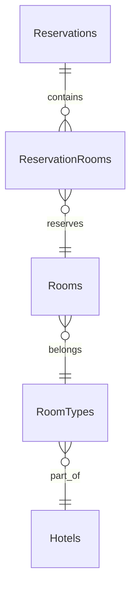

# Архитектура учебной системы бронирования отелей (OTUS)

## 1. Цель документа
Дать самодостаточное описание учебной системы бронирования: бизнес-потоки, микросервисы и их границы, схемы данных, контракты REST, обмен сообщениями через RabbitMQ, типовые сценарии для ролей и учебные задания для реализации.

## 2. Технологический стек и допущения
- Язык и платформа: .NET 8, C# 12.
- Архитектура: микросервисы с REST API, асинхронный обмен через RabbitMQ, шлюз на Ocelot.
- Данные: PostgreSQL (отдельные БД/схемы на сервис), ASP.NET Identity для аутентификации.
- Аутентификация/авторизация: JWT, роли `Customer`, `Manager`, `Admin`.
- Ограничения и упрощения: учебная нагрузка, нет реальных платежей и интеграций с OTA/Booking.com, простое ценообразование (базовые тарифы + сезонные коэффициенты), упрощённая политика отмены, SMTP/Telegram-бот без продакшн отказоустойчивости.

## 3. Высокоуровневый обзор системы
### 3.1. Основные роли и их сценарии
- Роль Customer (гость): поиск отеля по городу/датам, просмотр доступных номеров и цен, создание брони, просмотр и отмена своих броней по правилам.
- Роль Manager (менеджер отеля): список заездов/выездов на дату, check-in/check-out, ручная правка брони (смена номера/дат при доступности).
- Роль Admin (админ/владелец сети): создание/редактирование отелей, управление номерами/типами/тарифами, управление пользователями и ролями (назначение менеджеров), настройка системных параметров (например, удержание неоплаченной брони).

### 3.2. UI-слой
- Customer UI — публичный фронт для гостей.
- Manager UI — закрытый SPA для операционного персонала.
- Admin UI — административная панель.
- Все три UI работают только через API Gateway, прямых вызовов микросервисов нет.

### 3.3. API Gateway
- Ocelot выбран для единой точки входа, маршрутизации и унификации URL, проброса авторизации и добавления сквозного логирования/простых трансформаций.
- Шлюз скрывает детали адресов сервисов, упрощает фронту работу с JWT и ролями.

## 4. Архитектура микросервисов
### 4.1. IdentityService (Auth.Api)
- Ответственность: регистрация, логин, выдача/обновление JWT, управление ролями.
- Сущности: `User`, `Role`, `UserRole`, `RefreshToken` (модель ASP.NET Identity).
- Связи: `CustomerProfile` в CustomerService ссылается на `UserId`.
- Эндпоинты: `POST /api/auth/register`, `POST /api/auth/login`, `POST /api/auth/refresh`, `GET /api/auth/me`.

### 4.2. CustomerService (Customer.Api)
- Ответственность: расширенный профиль клиента (ФИО, контакты, предпочтения).
- Сущность: `CustomerProfile` (Id, UserId, FullName, Email, Phone, Preferences, CreatedAt, UpdatedAt).
- Операции: получение/обновление профиля текущего пользователя, поиск клиента по Id для менеджера.

### 4.3. HotelService (Hotel.Api)
- Ответственность: справочник отелей и номерного фонда, базовые цены и простые сезонные коэффициенты.
- Сущности: `Hotel`, `RoomType`, `Room`, `RatePlan`, `SeasonPrice`.
- Операции: CRUD для отелей, типов номеров, номеров, тарифов (Admin/Manager); выдача списка отелей и номерного фонда для Customer UI (чтение).

### 4.4. ReservationService (Reserve.Api)
- Ответственность: создание/изменение/отмена брони, проверка доступности, хранение статусов, разбиение по дням и номерам.
- Сущности: `Reservation` (Id, CustomerId, HotelId, Status: Draft/Booked/CheckedIn/CheckedOut/Cancelled/NoShow, CheckInDate, CheckOutDate, GuestsCount, TotalPrice, Currency, CreatedAt, UpdatedAt), `ReservationRoom` (Id, ReservationId, RoomId, StayDate). Уникальный индекс `(RoomId, StayDate)` предотвращает овербукинг.
- Операции: `POST /api/reservations`, `GET /api/reservations/{id}`, `GET /api/reservations/my`, `POST /api/reservations/{id}/cancel`, `POST /api/reservations/{id}/check-in`, `POST /api/reservations/{id}/check-out`.
- Проверка доступности: выбираем подходящие номера/типы из HotelService, создаём строки в `ReservationRooms`; при конфликте уникального индекса возвращаем ошибку «Нет доступных номеров».

### 4.5. AdminService (Admin.Api)
- Ответственность: единая точка управления для Admin.
- Особенности: своя минимальная БД для глобальных настроек; за данными обращается к другим сервисам через REST.
- Примеры операций: агрегированный список отелей со статистикой, управление пользователями/ролями как прослойка над IdentityService.

### 4.6. SchedulerService (Scheduler.Api / Scheduler.Worker)
- Ответственность: хранение и исполнение задач по расписанию.
- Сущность: `ScheduledJob` (Id, Type, Payload JSON, ExecuteAt (UTC), Status: Pending/InProgress/Completed/Failed, RetryCount, LastError).
- Поведение: на `ReservationCreated` создаёт `SendCheckInReminder` (за 24 часа до заезда) и `MarkNoShow` (вечер дня заезда). Worker каждую минуту подхватывает свои pending-задачи, помечает InProgress, публикует сообщения в RabbitMQ, завершает или увеличивает RetryCount. Обработчики идемпотентны.

### 4.7. NotificationService (Notification.Api)
- Ответственность: отправка email и Telegram-уведомлений.
- Сущности: `NotificationTemplate` (Id, Type, Channel, Subject, BodyTemplate, Locale), `OutgoingMessage` (Id, Type, Channel, Recipient, PayloadJson, Status, LastError, SentAt).
- Подписки: `ReservationCreated` (подтверждение), `ReminderDue` (напоминание), `ReservationCancelled` (уведомление об отмене).
- Каналы: SMTP и Telegram Bot API, креды в конфигурации, без захардкоженных секретов.

## 5. Межсервисное взаимодействие и RabbitMQ
- Основной путь фронтов — HTTP через API Gateway. Межсервисная асинхронщина — RabbitMQ.
- Exchange `hotel.reservation.events` (topic). Очереди на сервисы по событиям.

| Событие | Публикует | Подписаны | Назначение | Важные поля |
| --- | --- | --- | --- | --- |
| ReservationCreated | ReservationService | SchedulerService, NotificationService | Старт напоминаний, подтверждение клиенту | ReservationId, CustomerId, HotelId, CheckInDate, CheckOutDate, TotalPrice |
| ReservationCancelled | ReservationService | SchedulerService, NotificationService | Отменить задачи, уведомить клиента | ReservationId, Reason, CancelledAt |
| ReminderDue | SchedulerService | NotificationService | Отправить напоминание | ReservationId, CustomerId, HotelId, CheckInDate |
| NoShowMarked | ReservationService (по задаче планировщика) | AdminService (агрегация), NotificationService | Зафиксировать незаезд, уведомить | ReservationId, HotelId, MarkedAt |

Базовый паттерн: корреляция по ReservationId, обработчики идемпотентны (проверяют дубликаты по ключу сообщения), сохранение offset/lock в хранилище задач/уведомлений.

## 6. Базы данных и схемы
### 6.1. Общие правила
- У каждого микросервиса своя БД/схема в PostgreSQL; межсервисные связи только по Id.
- Поля аудита: `CreatedAt`, `UpdatedAt`, при необходимости `CreatedBy`, `UpdatedBy`.

### 6.2. Схема Identity
- `AspNetUsers` (Id UUID, UserName, NormalizedUserName, Email, PasswordHash, SecurityStamp, CreatedAt).
- `AspNetRoles` (Id UUID, Name, NormalizedName).
- `AspNetUserRoles` (UserId, RoleId).
- `AspNetUserTokens` (UserId, LoginProvider, Name, Value).
- `AspNetRefreshTokens` (Id, UserId, Token, ExpiresAt, CreatedAt, RevokedAt).

### 6.3. Схема Customer
- `CustomerProfiles` (Id UUID PK, UserId UUID, FullName text, Email text, Phone text, Preferences jsonb, CreatedAt timestamptz, UpdatedAt timestamptz). Индекс на UserId.

### 6.4. Схема Hotel
- `Hotels` (Id UUID PK, Name text, Address text, City text, Timezone text, CheckInTime time, CheckOutTime time, Description text, CreatedAt, UpdatedAt).
- `RoomTypes` (Id UUID PK, HotelId UUID FK, Name text, Capacity int, Description text, AmenitiesJson jsonb, CreatedAt, UpdatedAt). Индекс (HotelId, Capacity).
- `Rooms` (Id UUID PK, HotelId UUID, RoomTypeId UUID, RoomNumber text, Floor int, Status text, CreatedAt, UpdatedAt). Уникальный индекс (HotelId, RoomNumber).
- `RatePlans` (Id UUID PK, HotelId UUID, RoomTypeId UUID, Name text, BasePrice numeric(12,2), Currency text, CancellationPolicyType text, CreatedAt, UpdatedAt). Индекс (HotelId, RoomTypeId).
- `SeasonPrices` (Id UUID PK, HotelId UUID, RoomTypeId UUID, DateFrom date, DateTo date, PriceOverride numeric(12,2), Multiplier numeric(6,2), CreatedAt, UpdatedAt). Индекс (HotelId, RoomTypeId, DateFrom, DateTo).

### 6.5. Схема Reservation
- `Reservations` (Id UUID PK, CustomerId UUID, HotelId UUID, Status text, CheckInDate date, CheckOutDate date, GuestsCount int, TotalPrice numeric(12,2), Currency text, CreatedAt, UpdatedAt).
- `ReservationRooms` (Id UUID PK, ReservationId UUID, RoomId UUID, StayDate date, CreatedAt, UpdatedAt). Уникальный индекс `(RoomId, StayDate)` для исключения двойных броней.



### 6.6. Схема Scheduler
- `ScheduledJobs` (Id UUID PK, Type text, Payload jsonb, ExecuteAt timestamptz, Status text, RetryCount int, LastError text, CreatedAt, UpdatedAt). Индекс на ExecuteAt и Status для выборки due-задач.

### 6.7. Схема Notification
- `NotificationTemplates` (Id UUID PK, Type text, Channel text, Subject text, BodyTemplate text, Locale text, CreatedAt, UpdatedAt).
- `OutgoingMessages` (Id UUID PK, Type text, Channel text, Recipient text, PayloadJson jsonb, Status text, LastError text, SentAt timestamptz, CreatedAt, UpdatedAt). Индекс на Status для очереди отправки.

## 7. REST API: основные сценарии и контракты
### 7.1. Создание брони пользователем
1. UI вызывает `GET /api/hotels/{hotelId}/availability?checkIn=2024-05-10&checkOut=2024-05-12&guests=2` через Gateway (HotelService/ReservationService) и получает список доступных типов/тарифов.
2. Пользователь выбирает предложение → `POST /api/reservations`
```json
{
  "hotelId": "uuid-hotel",
  "roomTypeId": "uuid-roomtype",
  "ratePlanId": "uuid-rateplan",
  "checkInDate": "2024-05-10",
  "checkOutDate": "2024-05-12",
  "guestsCount": 2
}
```
3. Успех: `201 Created`
```json
{
  "id": "uuid-reservation",
  "status": "Booked",
  "hotelId": "uuid-hotel",
  "checkInDate": "2024-05-10",
  "checkOutDate": "2024-05-12",
  "guestsCount": 2,
  "totalPrice": 250.00,
  "currency": "USD"
}
```
4. Конфликт уникального индекса: `409 Conflict` с кодом `NoAvailableRooms`.

### 7.2. Отмена брони
- `POST /api/reservations/{id}/cancel`
  - Проверки: статус (нельзя отменить Cancelled/CheckedOut), политика отмены (упрощённо — бесплатно до Х часов до заезда).
  - Действия: смена статуса на Cancelled, удаление/деактивация `ReservationRooms`, публикация события `ReservationCancelled`.
  - Ответ: `200 OK` с итоговым статусом; ошибки: `400 BadRequest` (правило отмены), `404 NotFound`, `409 Conflict` (нельзя отменить).

### 7.3. Check-in / Check-out для менеджера
- `GET /api/manager/reservations/arrivals?date=2024-05-10` — ожидаемые заезды (Booked, CheckInDate=date).
- `POST /api/manager/reservations/{id}/check-in` — меняет статус на CheckedIn, публикует `ReservationCheckedIn` (опционально), логирует пользователя/менеджера.
- `POST /api/manager/reservations/{id}/check-out` — меняет статус на CheckedOut, освобождает номер, публикует `ReservationCheckedOut`.
- Ошибки: `400` (некорректный статус), `404`, `409` (конкурентный переход).

## 8. Планировщик: сценарии и тайминги
- Типы задач: `SendCheckInReminder`, `AutoCancelUnpaid`, `MarkNoShow`.
- Настраиваемые параметры: часов до напоминания (по умолчанию 24), часов до NoShow (например, 22:00 дня заезда), таймаут и лимит ретраев.
- Реакция на отмену брони: SchedulerService при событии `ReservationCancelled` помечает связанные `ScheduledJobs` как Cancelled/Failed или удаляет их логически.

## 9. Уведомления: шаблоны и формирование
- Примеры шаблонов:
  - Подтверждение брони: «Здравствуйте, {FullName}. Ваша бронь {ReservationId} в {HotelName} с {CheckInDate} по {CheckOutDate} подтверждена. Адрес: {HotelAddress}.»
  - Напоминание о заселении: «Напоминание: заезд {CheckInDate} после {HotelCheckInTime}. Бронь {ReservationId} в {HotelName}.»
  - Уведомление об отмене: «Бронь {ReservationId} в {HotelName} отменена. Причина: {Reason}.»
- Данные для подстановки: имя гостя, даты, название/адрес отеля, ссылка на бронь, контактные данные. Если событие не содержит всего — NotificationService запрашивает ReservationService/HotelService по Id.

## 10. Нефункциональные требования
- Логирование: стандартный ASP.NET logger + correlationId (`X-Correlation-ID`), бизнес-события (создание/отмена брони, отправка уведомления).
- Метрики: счётчик созданных броней, доля успешных/ошибочных попыток, количество отправленных уведомлений и ошибок, задержка отправки напоминаний.
- Ошибки: маппинг доменных ошибок в HTTP (400/404/409), ретраи с джиттером для внешних зависимостей (SMTP/Telegram/RabbitMQ), маскировка секретов в логах.

## 11. Учебные задания
- Базовый минимум: поднять API Gateway, IdentityService, HotelService, ReservationService; реализовать БД и миграции; сделать сценарий создания/отмены брони с защитой от двойного бронирования.
- Повышенная сложность: внедрить SchedulerService и NotificationService; отправка email/Telegram; добавить статусы NoShow и правила отмены; настроить простую политику бесплатной отмены до Х часов.
- Расширения: сервис платежей, интеграция с внешними каналами продаж, динамическое ценообразование.

## 12. Карты сервисов: продукт, техника, DoD
### IdentityService (Auth.Api)
- Продуктовое назначение: регистрация, логин, обновление токенов, управление ролями; минимальный UX для саморегистрации и входа.
- Техническое описание: ASP.NET Identity; JWT (access/refresh), роли `Customer/Manager/Admin`; эндпоинты `/api/auth/register|login|refresh|me`; хранит `Users`, `Roles`, `RefreshTokens`; публикует доменные события опционально (например, `UserRegistered`) в локальных сценариях.
- DoD: схемы/миграции Identity применены; JWT конфигурация вынесена в settings; валидация входных DTO; интеграционный тест login/refresh; OpenAPI обновлён на Gateway; нет захардкоженных секретов, `.env.example` заполнен.

### CustomerService (Customer.Api)
- Продуктовое назначение: хранение расширенного профиля клиента, чтобы менеджеры видели контактные данные и предпочтения.
- Техническое описание: сущность `CustomerProfile` связана с `UserId`; CRUD для профиля текущего пользователя (`GET/PUT /api/customers/me`), поиск профиля по Id для менеджера; события (опция) `CustomerProfileUpdated`; собственная БД с таблицей `CustomerProfiles`.
- DoD: миграции профилей применены; авторизация по JWT и проверка принадлежности профиля; unit тесты валидации и integration-тест `GET/PUT me`; OpenAPI обновлён; маскирование персональных данных в логах.

### HotelService (Hotel.Api)
- Продуктовое назначение: справочник отелей, типов номеров, номеров, тарифов и сезонных цен; источник данных для поиска и бронирования.
- Техническое описание: сущности `Hotel`, `RoomType`, `Room`, `RatePlan`, `SeasonPrice`; CRUD для Admin/Manager, публичные read-эндпоинты для поиска/availability; индексы на `Room` и `SeasonPrice` для дат; кэширование справочников по отелю (опционально).
- DoD: миграции по всем таблицам; валидации на уникальность номера в отеле и корректность дат сезонных цен; интеграционные тесты CRUD и публичного каталога; OpenAPI актуален; роли на эндпоинтах (Admin/Manager vs публичные).

### ReservationService (Reserve.Api)
- Продуктовое назначение: создание и управление бронированиями с защитой от овербукинга, поддержка отмен и статусов check-in/out.
- Техническое описание: `Reservation`, `ReservationRoom` с уникальным `(RoomId, StayDate)`; сценарии `POST /api/reservations`, `GET /api/reservations/{id|my}`, `cancel`, `check-in`, `check-out`; обращение к HotelService за доступностью; публикация событий `ReservationCreated/Cancelled/CheckedIn/CheckedOut/NoShowMarked`; обрабатывает откаты при конфликте уникального индекса.
- DoD: миграции и уникальные индексы применены; юзкейсные интеграционные тесты (успешное бронирование, конфликт 409, отмена освобождает слот, check-in/out переходы); маппинг доменных ошибок в HTTP; события отправляются в RabbitMQ с идемпотентным ключом; OpenAPI обновлён.

### AdminService (Admin.Api)
- Продуктовое назначение: единый вход для администратора сети, управление отелями, пользователями и глобальными настройками.
- Техническое описание: минимальная собственная таблица `SystemSettings`; агрегирующие read-эндпоинты поверх Hotel/Reservation/Identity; операции назначения ролей/менеджеров; может кешировать сводки.
- DoD: авторизация только `Admin`; интеграционные тесты агрегаций (моки внешних сервисов); настройки кэширования/таймаутов; OpenAPI актуален; обработка ошибок внешних вызовов с ретраями/таймаутами.

### SchedulerService (Scheduler.Api / Worker)
- Продуктовое назначение: выполнение отложенных действий (напоминания, NoShow, автоотмена).
- Техническое описание: таблица `ScheduledJobs`; API для планирования/отмены (внутренние), worker с выборкой due-задач, блокировкой, ретраями; публикует `ReminderDue`, инициирует `MarkNoShow`; реагирует на `ReservationCancelled` для деактивации задач.
- DoD: миграции для `ScheduledJobs`; due-выборка с индексацией по `ExecuteAt`/`Status`; идемпотентная публикация (дедуп по JobId); интеграционные тесты воркера (happy path, retry, cancel); конфиги таймингов вынесены в settings; хелсчеки live/ready.

### NotificationService (Notification.Api)
- Продуктовое назначение: рассылка подтверждений, напоминаний и отмен клиентам по email/Telegram.
- Техническое описание: `NotificationTemplate`, `OutgoingMessage`; потребляет `ReservationCreated`, `ReservationCancelled`, `ReminderDue`; формирует сообщения, отправляет через SMTP/Telegram Bot API; очередь рассылки по статусу.
- DoD: миграции для шаблонов/очереди; конфиги каналов в settings и `.env.example`; интеграционные тесты шаблонизации и обработки события; идемпотентность (проверка дубликатов по ReservationId+Type); метрики отправок/ошибок; OpenAPI для внутренних вспомогательных эндпоинтов (например, предпросмотр шаблона).

### API Gateway (Ocelot)
- Продуктовое назначение: единая точка входа для всех UI, единый домен, сквозная авторизация.
- Техническое описание: маршрутизация к сервисам, проброс JWT и ролей, унификация префиксов `/api/*`, базовое логирование/корреляция, опционально rate limiting для публичных маршрутов.
- DoD: ocelot.json с маршрутами для всех сервисов, включая версии; проверка проброса заголовков авторизации и correlationId; smoke-тесты на основные сценарии (регистрация, поиск, бронирование через шлюз); документация по запуску и конфигу.
